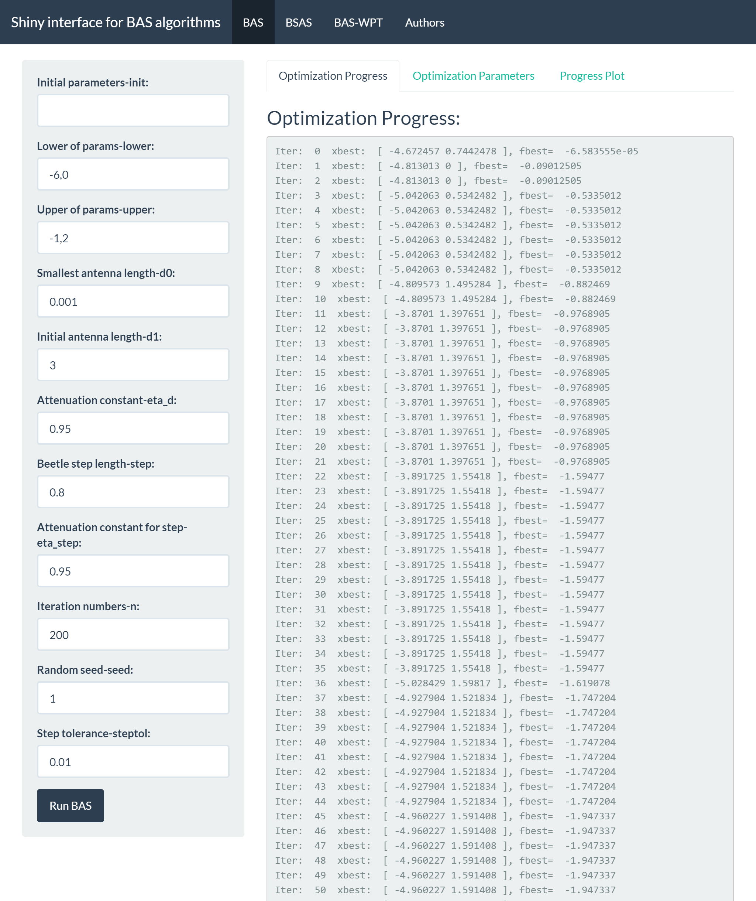
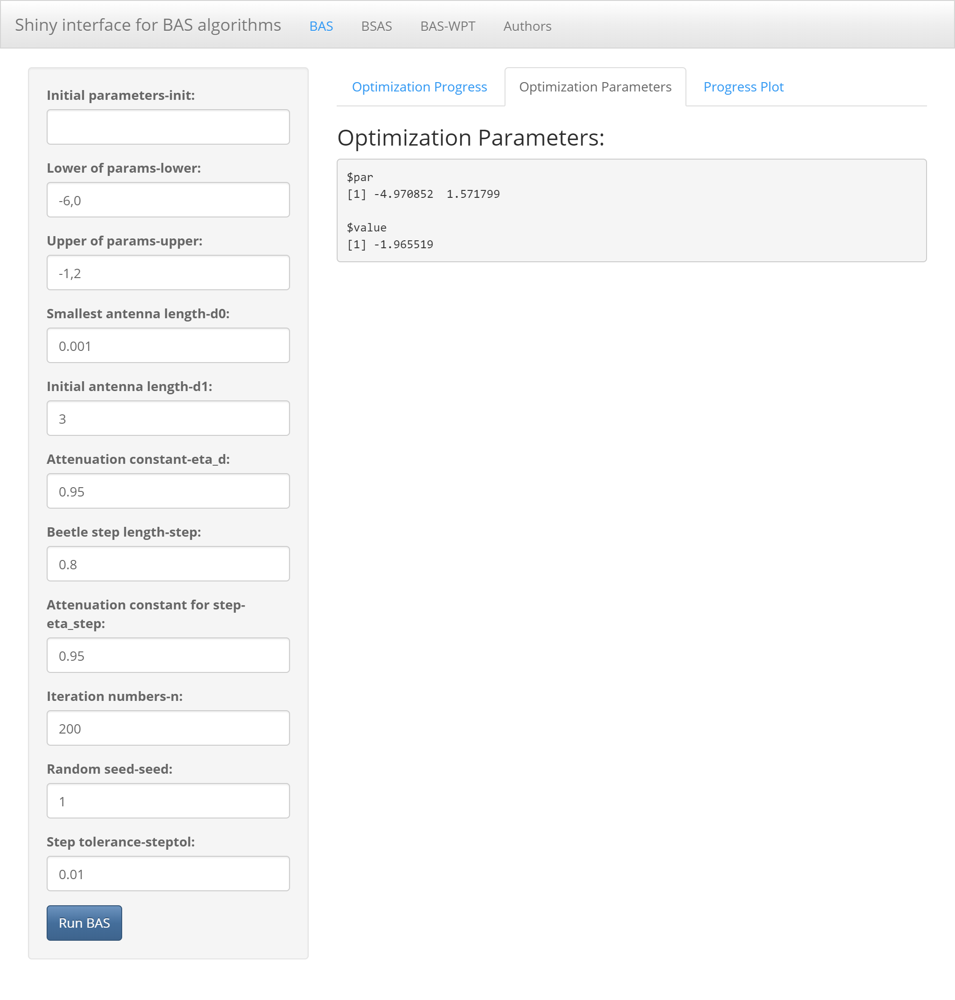

```{r, echo = FALSE}
knitr::opts_chunk$set(
  collapse = TRUE,
  comment = "#>",
  fig.path = "README-"
)
```
## rBAS 
>An R module aimed at implementation of Beetle Antennae Search (BAS) Algorithm and its mutations, for example, Beetle Swarm Antenae Search (BSAS) Algorithm.

---
-   [Installation](#installation)
-   [Algorithm & References](#algorithm)
    -   [BAS](#bas)
    -   [BSAS](#bsas)
    -   [BAS-WPT](#bas-wpt)
-   [Examples](#examples)
    -   [Michalewicz function](#michalewicz-function)
    -   [Goldstein-Price function](#goldstein-price-function)
    -   [Implementation of BSAS](#bsas-algorithm)
    -   [Shiny interface](#shiny-interface)
        -   [Theme: united](#theme-united)
        -   [Theme: flatly](#theme-flatly)
        -   [Theme: spacelab](#theme-spacelab)
-   [To do list](#to-do-list)
-   [Author](#author)
-   [Citation](#citation)
-   [License](#license)

## Installation
`rBAS` is currently not on CRAN. You can install `rBAS` from Github with:
```{r,eval=FALSE}
devtools::install_github("jywang2016/rBAS")
```

## Algorithm

### BAS
[X. Y. Jiang, and S. Li, “BAS: beetle antennae search algorithm for
optimization problems,” arXiv:1710.10724v1.](https://arxiv.org/abs/1710.10724)

### BSAS
[J. Y. Wang, and H. X. Chen, “BSAS: Beetle Swarm Antennae Search Algorithm for Optimization Problems,” arXiv:1807.10470v1.](https://arxiv.org/abs/1807.10470) If you want to find materials in Chinese about BSAS,
please click [here](https://github.com/jywang2016/BAS/blob/master/BAS_Swarm_documentation.html).

### BAS-WPT
[X. Y. Jiang, and S. Li, “Beetle Antennae Search without Parameter Tuning
(BAS-WPT) for Multi-objective Optimization,” arXiv:1711.02395v1.](https://arxiv.org/abs/1711.02395)

## Examples

Use `help()` to see the document pages about functions in `rBAS`.

```{r,eval=FALSE}
library(rBAS) #load package

help(BASoptim)
help(BSASoptim)
```


Two typocal test functions are applied to validate the efficacy of BAS/BSAS algorithm

### Michalewicz function


```{r}
library(rBAS)
mich <- function(x){
  y1 <- -sin(x[1])*(sin((x[1]^2)/pi))^20
  y2 <- -sin(x[2])*(sin((2*x[2]^2)/pi))^20
  return(y1+y2)
}
```

```{r}
test<-
  BASoptim(fn = mich,
           lower = c(-6,0), upper = c(-1,2),
           seed = 1, n = 100,trace = F)

test$par
test$value
summary(test$df)
```

### Goldstein-Price function

```{r}
gold <- function(x){
  x1 <- x[1]
  x2 <- x[2]
  y1 <- 1 + (x1 + x2 + 1)^2*(19 - 14*x1+3*x1^2 - 14*x2 + 6*x1*x2 + 3*x2^2)
  y2 <- 30 + (2*x1 -3*x2)^2*(18 - 32*x1 + 12*x1^2+48*x2-36*x1*x2 + 27*x2^2)
  return(y1*y2)
}
```

```{r}
test<-
  BASoptim(fn = gold,
           lower = c(-2,-2), upper = c(2,2),
           seed = NULL, n = 100,trace = F)

test$par
test$value
summary(test$df)
```

### BSAS algorithm

In order to save space, the BSAS algorithm code is executed with `trace` as `FALSE` because of too much trace information. You can set `trace` to `TRUE` and observe the trace messages.
```{r}
test<-
  BSASoptim(fn = mich,
            lower = c(-6,0), upper = c(-1,2),
            seed = 12, n = 100,k=5,
            trace = F)

test$par
test$value
summary(test$df)
```

```{r}
test<-
  BSASoptim(fn = gold,
            lower = c(-2,-2), upper = c(2,2),
            seed = 11, n = 100,k=2,
            trace = F)

test$par
test$value
summary(test$df)
```


###Shiny interface
In 0.1.0, [shiny](https://shiny.rstudio.com/) interface is added into `rBAS`. Now, the users only need to define
their objective problems in R code. And the rest of paramsters in `BASoptim` or `BSASoptim` functions can be adjust in the shiny interface. 


#### theme united
For example, `Michalewicz function` can be imported to shiny with `united` theme as follows,

```{r,eval=FALSE}
run_BAS_App(func = mich, theme = 'united')
```


####theme flatly
`flatly` theme:

```{r,eval=FALSE}
run_BAS_App(func = mich, theme = 'flatly')
```



####theme spacelab
`spacelab` theme:

```{r,eval=FALSE}
run_BAS_App(func = mich, theme = 'spacelab')
```

The `theme` argument is used to provides Bootstrap themes for shiny. More details can be found in [`shinythemes`](https://github.com/rstudio/shinythemes). Or you can use `help(run_BAS_App)` to check which
themes you can choose.

## To do list

- ~~add implement of BSAS algorithm~~
- add [BAS-WPT(without parameter tuning)](https://arxiv.org/abs/1711.02395)
- ~~add Shiny graphical interface~~

You can list your requirements in the [issues](https://github.com/jywang2016/rBAS/issues). Furthermore, if you have a good idea or codes about BAS's mutations, pull requests and discussions are welcome. Contact me by email: jywang_2016@hust.edu.cn

## Author
`Jiangyu Wang`

[github page](https://github.com/jywang2016)

*School of Energy and Power Engineering, Huazhong University of Science and Technology*

`Shuai Li`   

-   [personal homepage](http://www4.comp.polyu.edu.hk/~cssli/) 

-   [Googlescholar](http://scholar.google.com/citations?hl=zh-CN&user=H8UOWqoAAAAJ)

*Department of Computing, The Hong Kong Polytechnic University*

## Citation

```{r}
citation(package = 'rBAS')
```


## License

The project is released under the terms of the GPL-3.0.

Copyright © 2018 Jiangyu Wang
