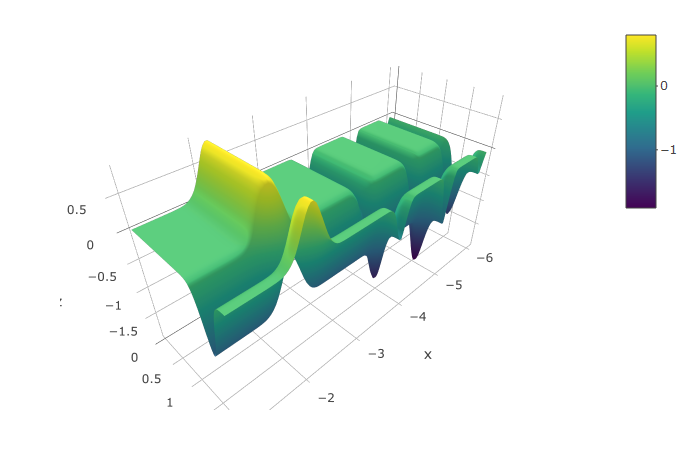
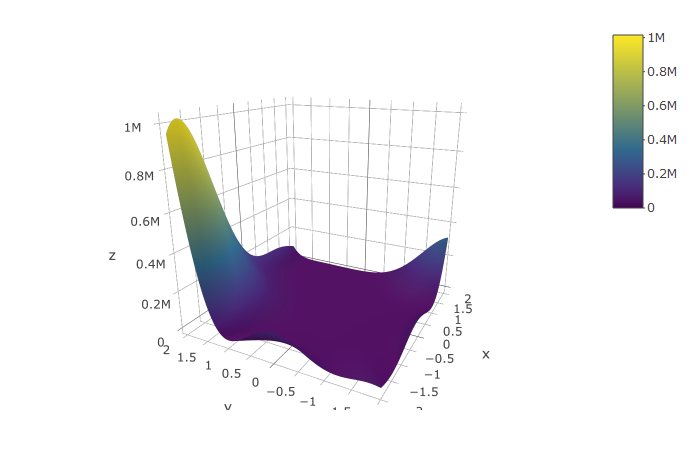

rBAS 
-----------------------------------------------------

> An R module aimed at implementation of Beetle Antennae Search (BAS) Algorithm and its mutations, for example, Beetle Swarm Antenae Search (BSAS) Algorithm.

------------------------------------------------------------------------

-   [Installation](#installation)
-   [Examples](#examples)
    -   [Michalewicz function](#michalewicz-function)
    -   [Goldstein-Price function](#goldstein-price-function)
    -   [Mixed integer nonlinear programming](#pressure-vessel)
    -   [Implementation of BSAS](#bsas-algorithm)
    -   [Shiny interface](#shiny-interface)
-   [To do list](#to-do-list)
-   [Author](#authors)
-   [Citation](#citation)
-   [References](#references)
    -   [BAS](#bas)
    -   [BSAS](#bsas)
    -   [BAS-WPT](#bas-wpt)
    -   [BSO](#bso)
-   [License](#license)

Installation
------------

`rBAS` is currently not on CRAN. You can install `rBAS` from Github with:

``` r
devtools::install_github("jywang2016/rBAS")
```

Examples
--------

Use `help()` to see the document pages about functions in `rBAS`.

``` r
library(rBAS) #load package

help(BASoptim)
help(BSASoptim)
```

Two typocal test functions are applied to validate the efficacy of BAS/BSAS algorithm

### Michalewicz function



``` r
library(rBAS)
mich <- function(x){
  y1 <- -sin(x[1])*(sin((x[1]^2)/pi))^20
  y2 <- -sin(x[2])*(sin((2*x[2]^2)/pi))^20
  return(y1+y2)
}
```

``` r
test<-
  BASoptim(fn = mich,
           lower = c(-6,0), upper = c(-1,2),
           seed = 1, n = 100,trace = F)

test$par
#> [1] -4.964687  1.575415
test$value
#> [1] -1.966817
summary(test$df)
#>       Length Class  Mode   
#> x     174    -none- numeric
#> f      87    -none- numeric
#> xbest 174    -none- numeric
#> fbest  87    -none- numeric
```

### Goldstein-Price function



``` r
gold <- function(x){
  x1 <- x[1]
  x2 <- x[2]
  y1 <- 1 + (x1 + x2 + 1)^2*(19 - 14*x1+3*x1^2 - 14*x2 + 6*x1*x2 + 3*x2^2)
  y2 <- 30 + (2*x1 -3*x2)^2*(18 - 32*x1 + 12*x1^2+48*x2-36*x1*x2 + 27*x2^2)
  return(y1*y2)
}
```

``` r
test<-
  BASoptim(fn = gold,
           lower = c(-2,-2), upper = c(2,2),
           seed = NULL, n = 100,trace = F)

test$par
#> [1]  0.001870855 -0.996496153
test$value
#> [1] 3.004756
summary(test$df)
#>       Length Class  Mode   
#> x     174    -none- numeric
#> f      87    -none- numeric
#> xbest 174    -none- numeric
#> fbest  87    -none- numeric
```

### Pressure Vessel

``` r
pressure_Vessel <- list(
  obj = function(x){
    x1 <- floor(x[1])*0.0625
    x2 <- floor(x[2])*0.0625
    x3 <- x[3]
    x4 <- x[4]
    result <- 0.6224*x1*x3*x4 + 1.7781*x2*x3^2 +3.1611*x1^2*x4 + 19.84*x1^2*x3
  },
  con = function(x){
    x1 <- floor(x[1])*0.0625
    x2 <- floor(x[2])*0.0625
    x3 <- x[3]
    x4 <- x[4]
    c(
      0.0193*x3 - x1,
      0.00954*x3 - x2,
      750.0*1728.0 - pi*x3^2*x4 - 4/3*pi*x3^3
    )
  }
)
```

``` r
result <- BSASoptim(fn = pressure_Vessel$obj,
                    k = 10,
                    lower =c( 1, 1, 10, 10),
                    upper = c(100, 100, 200, 200),
                    constr = pressure_Vessel$con,
                    n = 200,
                    step = 100,
                    d1 = 4,
                    pen = 1e6,
                    steptol = 1e-6,
                    n_flag = 2,
                    seed = 2,trace = FALSE)

result$par
#> [1]  14.077163   7.087842  45.335198 140.284669
result$value
#> [1] 6090.567
```

### BSAS/BSO and more algorithms

In order to save space, the BSAS algorithm code is executed with `trace` as `FALSE` because of too much trace information. You can set `trace` to `TRUE` and observe the trace messages.

``` r
test<-
  BSASoptim(fn = mich,
            lower = c(-6,0), upper = c(-1,2),
            seed = 12, n = 100,k=5,
            trace = F)

test$par
#> [1] -4.968610  1.557598
test$value
#> [1] -1.960214
summary(test$df)
#>   Length Class  Mode   
#> x 202    -none- numeric
#> f 101    -none- numeric
```

``` r
test<-
  BSASoptim(fn = gold,
            lower = c(-2,-2), upper = c(2,2),
            seed = 11, n = 100,k=2,
            trace = F)

test$par
#> [1]  0.0113079 -0.9948412
test$value
#> [1] 3.030877
summary(test$df)
#>   Length Class  Mode   
#> x 202    -none- numeric
#> f 101    -none- numeric
```

If you want find more algorithm which is avaliable in `rBAS`.You can visit the [Reference](https://jywang2016.github.io/rBAS/reference/index.html) page. And click the function name. Furthermore, you can also get more examples by this way. For example, the Pressure-Vessel problem solved by BSO algorithm can be found [here](https://jywang2016.github.io/rBAS/reference/BSOoptim.html).

### Shiny interface

After `rBAS 0.1.0`, [shiny](https://shiny.rstudio.com/) interface is added into `rBAS`. Now, the users only need to define their objective problems in R code. And the rest of paramsters in `BASoptim` or `BSASoptim` functions can be adjust in the shiny interface.

For example, `Michalewicz function` can be imported to shiny with `united` theme as follows,

``` r
run_BAS_App(func = mich)
```


The `theme` argument is used to provides Bootstrap themes for shiny. More details can be found in [`shinythemes`](https://github.com/rstudio/shinythemes). Or you can use `help(run_BAS_App)` to check which themes you can choose.

To do list
----------

Algorithm:

-   ~~add implement of BSAS algorithm~~
-   ~~add BAS-WPT(without parameter tuning)(Xiangyuan Jiang)~~
-   add binary BAS algorithm (Yue Ruan)
-   add second-order BAS algorithm (Xiaoxiao Li)
-   add BSO(Beetle Swarm Optimizaiton) (Tiantian Wang)
-   ...

Application:

-   constrained optimization:
    -   multi-bar mechanism optimization
    -   system identification for building (resistance-capacity model)
    -   assembly path planning
    -   lot-sizing problems(binary BAS)
-   tests
    -   tests for more than 20 benchmark functions

UI interface:

-   basic interface
    -   ~~add basic [shiny](https://github.com/rstudio/shiny) graphical interface~~
    -   ~~upload constraints.txt~~
-   automatic report generation
    -   report generation based on [rmarkdown](https://github.com/rstudio/rmarkdown)
    -   report download

You can list your requirements in the [issues](https://github.com/jywang2016/rBAS/issues). Furthermore, if you have a good idea or codes about BAS's mutations, pull requests and discussions are welcome. Contact me by email: <jywang_2016@hust.edu.cn>

Authors
-------

`Jiangyu Wang`

[github page](https://github.com/jywang2016)

*School of Energy and Power Engineering, Huazhong University of Science and Technology*

`Shuai Li`

[personal homepage](http://www4.comp.polyu.edu.hk/~cssli/) & [Googlescholar](http://scholar.google.com/citations?hl=zh-CN&user=H8UOWqoAAAAJ)

*Department of Computing, The Hong Kong Polytechnic University*

`Xiangyuan Jiang`

*Department of Computing, The Hong Kong Polytechnic University*

Citation
--------

``` r
citation(package = 'rBAS')
#> 
#> To cite package 'rBAS' in publications use:
#> 
#>   Jiangyu Wang, Shuai Li and Xiangyuan Jiang (2018). rBAS:
#>   Implementation of the BAS algorithm and its mutation. R package
#>   version 0.1.6. https://github.com/jywang2016/rBAS
#> 
#> A BibTeX entry for LaTeX users is
#> 
#>   @Manual{,
#>     title = {rBAS: Implementation of the BAS algorithm and its mutation},
#>     author = {Jiangyu Wang and Shuai Li and Xiangyuan Jiang},
#>     year = {2018},
#>     note = {R package version 0.1.6},
#>     url = {https://github.com/jywang2016/rBAS},
#>   }
```

References
----------

### BAS

[X. Y. Jiang, and S. Li, “BAS: beetle antennae search algorithm for optimization problems,” arXiv:1710.10724v1.](https://arxiv.org/abs/1710.10724)

### BSAS

[J. Y. Wang, and H. X. Chen, “BSAS: Beetle Swarm Antennae Search Algorithm for Optimization Problems,” arXiv:1807.10470v1.](https://arxiv.org/abs/1807.10470). Chinese Handbook of rBAS, please click [here](https://jywang2016.github.io/rBAS_documents/).

### BAS-WPT

[X. Y. Jiang, and S. Li, “Beetle Antennae Search without Parameter Tuning (BAS-WPT) for Multi-objective Optimization,” arXiv:1711.02395v1.](https://arxiv.org/abs/1711.02395)

### BSO

[Wang T, Yang L, Liu Q. "Beetle Swarm Optimization Algorithm:Theory and Application," arXiv:1808.00206v1.](https://arxiv.org/abs/1808.00206)

License
-------

The project is released under the terms of the GPL-3.0.

Copyright © 2018 Jiangyu Wang
